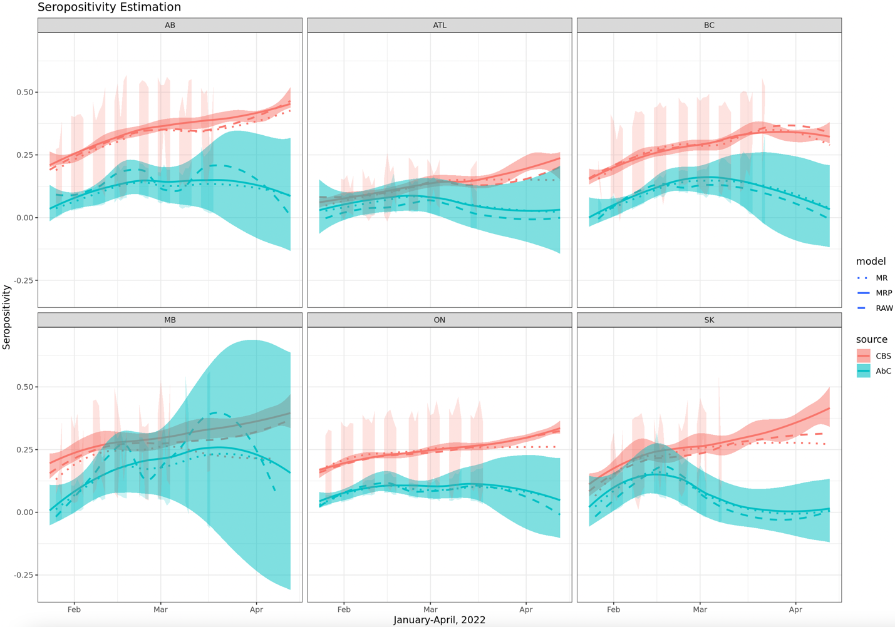
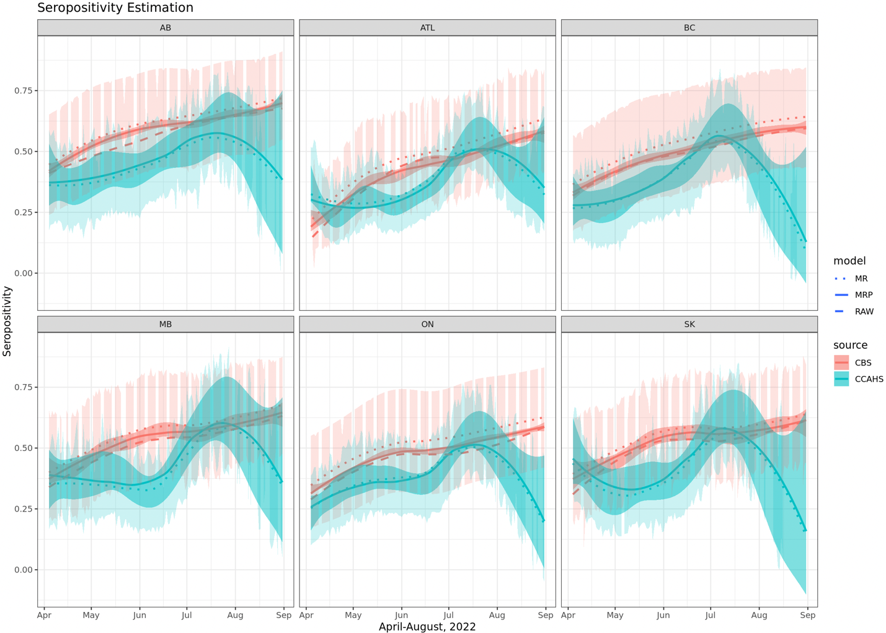
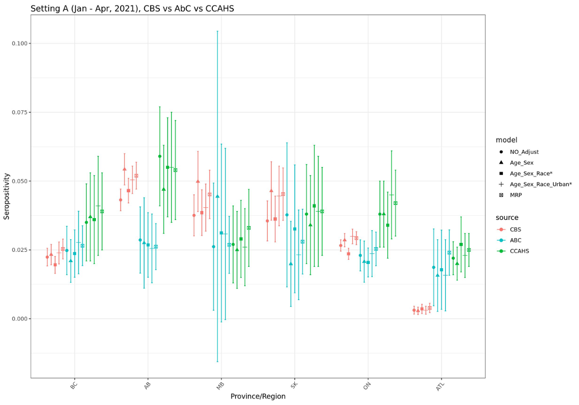
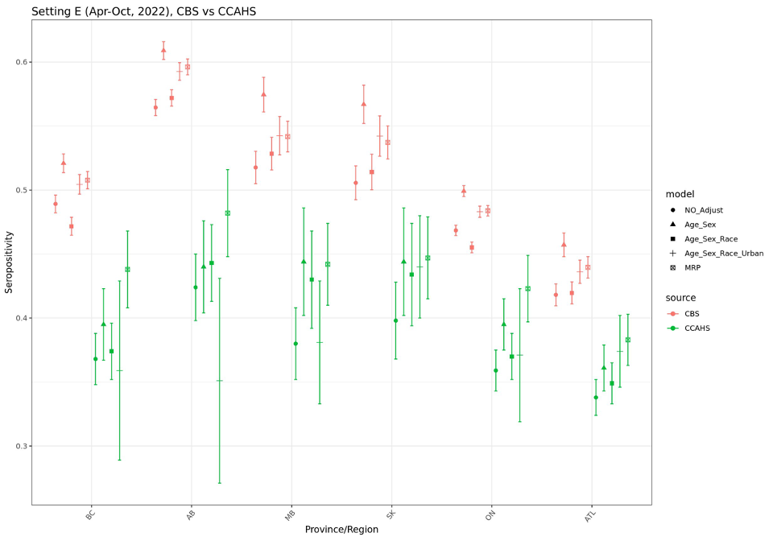
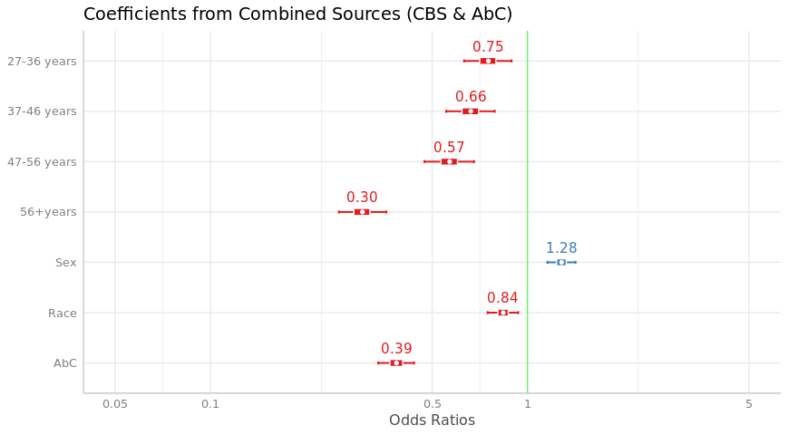

\newcommand{\1}{\textbf{1}}

Yuan Yu^1^, Sheila O'Brien^2^, David L. Buckeridge^1^, W. Alton Russell^1^

<br>

^1^School of Population and Global Health, McGill University, Montreal, Canada

^2^ Canadian Blood Services, Ottawa, Canada

<br>

**Corresponding author:**

**Key words:**

**Running title:**

##### 


```{r setup, include=FALSE}
library(ggplot2) #plots
library(data.table) #for using datatables instead of frames
library(scales) #formatting plot legends and text
library(readxl) #read.excel
library(flextable) #generating tables
library(ftExtra)
library(officedown) #formatting for word
library(officer)
library(stringr)
theme_set(theme_bw())
knitr::opts_chunk$set(
  echo       = FALSE,
  message    = FALSE,
  warning    = FALSE
)

#takes table column containing references for sources
gen_tab_sourcestr <- function(sources_raw){
  sources <- str_match(sources_raw, ".*\\[@\\s*(.*?)\\s*\\]")[,2]
  #remove NA
  sources <- sources[!is.na(sources)]
  #attack '@
  sources <- paste0("@", sources)
  #add commas
  sources[-length(sources)] <- paste0(sources[-length(sources)], "; ")
  sources <- paste0("[", paste0(sources, collapse=""), "]")
  return(sources)
}

num_patients = 2000

```

```{r}
df_samp <- read_excel("../1_data/tables.xlsx", sheet = "sample")
sourcestr_t_samp <- gen_tab_sourcestr(df_samp$Source)
```

# Abstract
Blood donors serve as a crucial population for serosurveillance due to its convenient data collection process compared to other public health surveys. The fact that it consists large proportion of the elder male population might throw doubts on the seropositivity estimation for the general population. In this paper, firstly, we compared the seropositivity estimation of the general population across different data resources for varies time period, evaluating the effect of multilevel regression and poststratification (MRP) in comparison to traditional statistical adjustment approach like raking. Secondly, we further tracked the temporal pattern of the MRP adjusted seropositivity curve to find that representation error is not the main cause of the serosurveillance discrepancy across different data resources, by evaluating the average absolute difference and proportion of days of closer estimations before and after the evaluation. The gap of serosurveillance for the general population among different resources depend on varies factors including the data collection, blood sample type (serum or dried blood spots), assay difference and operating labs. 

**Background:** A

**Methods:** A

**Results:** A

**Conclusions:** A

##### 

# Introduction

> Citation [@Langham2018a]

<br>    

# Methods

> Data: CBS, CCAHS, ABC, APL, CLSA, CanPath

> Modeling: Multilevel Regression and Poststritification (Theorem, regression variables, poststratification table)

## Subsection

> See `r run_reference("f-sample")`. See `r run_reference("f-sample-2")`.

<br>

# Results

The MRP generally provides more precise estimates with lower CV (coefficient of variance = mean/sd) and admissible compared with other adjusting methods like raking and raw post-stratification, especially adjusting for multiple demographic features when aggregation table is sparse for smaller sample size (i.e. AbC). 

Especially, for later Omicron period, MRP could pull the seropositivity estimation together in comparing the adjusted and unadjusted seropositivity comparing the CBS and CCAHS II, for both overall and temporal seropositivity estimation. However, MRP does not seem to have the same effect on the earlier period when comparing with other data resources, no matter for overall or temporal seropositivity.  

Even within the same data source, MRP does not adjust the seropositivity in the same direction. For example, it tends to adjust the trend higher for the Prairies regions during the earlier Omicron but lower for the latter period.

Since there is still an obvious gap between the population level seropositivity curves after adjusted for the potential representation error. For evaluating the potential cause of the discrepancy, we provide the coefficient analysis of the log-odds for a combined data source including the type of the blood. It showed that the higher seropositivity might be caused by serum blood samples collected by the CBS, compared to the dried blood spots used in AbC. 
> A

<br>

# Discussion

> A

<br>

##### 

# Declarations

**Funding:** A

**Conflicts:** A

**Ethics/Consent:** A

**Data and materials:** A

**Code availability:** A

**Authors' contributions:**

##### 

# References

::: {#refs}
:::

##### 

# Tables

```{r}
tab_num <- run_autonum(seq_id = "tab", 
                       pre_label = "Table ", 
                       bkm="t-sample",
                       bkm_all = TRUE,
                       prop = fp_text(bold=TRUE, underlined = TRUE))


t_samp <- as_flextable(as_grouped_data(df_samp,
                                              groups = "subhead"))
t_samp <- compose(t_samp, i = ~ !is.na(subhead), j = "col1",
              value = as_paragraph(as_chunk(subhead)))

t_samp <- fontsize(t_samp, size = 10, part = "all")
t_samp <- font(t_samp, fontname = "Times", part = "all")
t_samp <- theme_box(t_samp)
t_samp <- bg(t_samp, bg = "#EAEAEA", part = "header")
t_samp <- width(t_samp, 1, 1.7)
t_samp <- bg(t_samp, i = c(1, 3), bg = "#DDDDDD", part = "body")
t_samp <- bold(t_samp, i = c(1, 3), part = "body")
t_samp <- align(t_samp, align = "left", part = "all")
t_samp <- set_caption(t_samp,
                      "This is a sample table.",
                      autonum = tab_num)
# t_samp <- footnote(t_samp, i=1, j=1, part="header",ref_symbols ="1",
#                          value=as_paragraph("This is a footnote."))
t_samp <-  colformat_md(t_samp, j=2:3, part="body",
                        pandoc_args = c('--csl', 'refs-in-tables.csl'))


t_samp
```

##### 

# Figures

```{r fig.width=7, fig.height=4}
fig_num <- run_autonum(seq_id = "fig",
                       pre_label = "Figure ",
                       bkm="f-sample",
                       bkm_all = TRUE,
                       prop = fp_text(bold=TRUE, underlined = TRUE))



block_caption("Seropositivity estimation during Omicron, January - April, 2022. Average absolute difference between CBS vs AbC are 0.138 and 0.165 from MR and MRP model correspondingly; Proportion of days of closer estimations from MRP are 18%, 43%, 44%, 62%, 49%, 29% for Alberta, Atlantic region, British Columbia, Manitoba, Ontario and Saskatchewan. MRP does not make estimations from different sources closer for most overlapping time periods of CBS and AbC especially for AB and SK. Note: Darker shades indicate a loess smoothing for estimates of daily seroposotivity.", 
              style = "Image Caption", 
              autonum = fig_num)

```

```{r fig.width=7, fig.height=4}
fig_num <- run_autonum(seq_id = "fig",
                       pre_label = "Figure ",
                       bkm="f-sample",
                       bkm_all = TRUE,
                       prop = fp_text(bold=TRUE, underlined = TRUE))



block_caption("Seropositivity estimation during Omicron, January - April, 2022. Average absolute difference between CBS vs CCAHS II are 0.141 and 0.1113 from MR and MRP model correspondingly; Proportion of days of closer estimations from MRP are 94%, 77%, 83%, 83%, 91%, 75% for Alberta, Atlantic region, British Columbia, Manitoba, Ontario and Saskatchewan. MRP makes estimations from different sources closer for most overlapping time periods of CBS and CCAHS II.", 
              style = "Image Caption", 
              autonum = fig_num)

```
##### 

# Supplemental materials

<br>

# A. Supplement section

##### 

# Supplemental tables

<!-- ```{r} -->
<!-- stab_num <- run_autonum(seq_id = "stab", -->
<!--                        pre_label = "Table S", -->
<!--                        bkm="t-sample-2", -->
<!--                        bkm_all = TRUE, -->
<!--                        prop = fp_text(bold=TRUE, underlined = TRUE)) -->

<!-- t_samp <- as_flextable(as_grouped_data(read_excel("../1_data/tables.xlsx", sheet = "sample"), -->
<!--                                               groups = "subhead")) -->
<!-- t_samp <- compose(t_samp, i = ~ !is.na(subhead), j = "col1", -->
<!--               value = as_paragraph(as_chunk(subhead))) -->
<!-- t_samp <- fontsize(t_samp, size = 10, part = "all") -->
<!-- t_samp <- font(t_samp, fontname = "Times", part = "all") -->
<!-- t_samp <- theme_box(t_samp) -->
<!-- t_samp <- bg(t_samp, bg = "#EAEAEA", part = "header") -->
<!-- t_samp <- width(t_samp, 1, 1.7) -->
<!-- t_samp <- bg(t_samp, i = c(1, 3), bg = "#DDDDDD", part = "body") -->
<!-- t_samp <- bold(t_samp, i = c(1, 3), part = "body") -->
<!-- t_samp <- set_caption(t_samp, -->
<!--                       "This is a sample table.", -->
<!--                       autonum = stab_num) -->
<!-- t_samp <- align(t_samp, align = "left", part = "all") -->
<!-- t_samp <-  colformat_md(t_samp, j=2:3, part="body") -->

<!-- t_samp -->
<!-- ``` -->

##### 

# Supplemental figures

```{r}
#sfig_autonum <- run_autonum(seq_id = "sfig", pre_label = "Figure S", bkm="f-sample-2", start_at=1)
```

```{r, fig.width=6, fig.height=4}

sfig_num <- run_autonum(seq_id = "sfig", 
                       pre_label = "Figure S", 
                       bkm="f-sample-2",
                       bkm_all = TRUE,
                       prop = fp_text(bold=TRUE, underlined = TRUE))




block_caption("Seropositivity During Vaccination Period (Jan – Apr, 2021, CBS vs AbC vs CCAHS I)", 
              style = "Image Caption", 
              autonum = sfig_num)
```

```{r, fig.width=6, fig.height=4}

sfig_num <- run_autonum(seq_id = "sfig", 
                       pre_label = "Figure S", 
                       bkm="f-sample-2",
                       bkm_all = TRUE,
                       prop = fp_text(bold=TRUE, underlined = TRUE))




block_caption("Seropositivity During Omicron (Apr – Aug, 2022, CBS vs CCAHS II)", 
              style = "Image Caption", 
              autonum = sfig_num)
```

```{r, fig.width=6, fig.height=3.5}

sfig_num <- run_autonum(seq_id = "sfig", 
                       pre_label = "Figure S", 
                       bkm="f-sample-2",
                       bkm_all = TRUE,
                       prop = fp_text(bold=TRUE, underlined = TRUE))



block_caption("Odds Ratio Across combined dataset from multiple data sources", 
              style = "Image Caption", 
              autonum = sfig_num)
```


